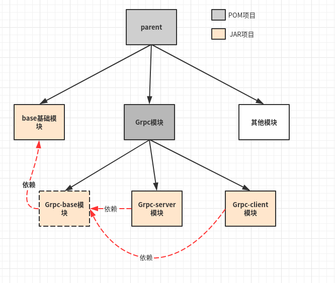
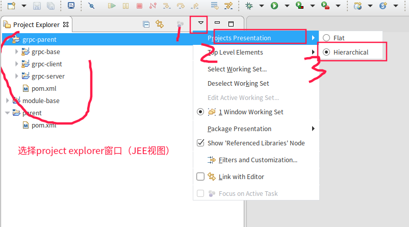

## 架构图




## eclipse视图




## 目录结构图

```bash
├── grpc-parent (grpc模块)
│   ├── grpc-base （grpc基础模块）
│   │   ├── pom.xml
│   │   ├── src
│   │   └── target
│   ├── grpc-client (grpc客户端模块)
│   │   ├── pom.xml
│   │   ├── src
│   │   └── target
│   ├── grpc-server (grpc服务端模块)
│   │   ├── pom.xml
│   │   ├── src
│   │   └── target
│   └── pom.xml
├── module-base (基础模块)
│   ├── pom.xml
│   ├── src
│   │   ├── main
│   │   └── test
│   └── target
│       ├── classes
│       └── test-classes
└── parent (父工程)
    └── pom.xml
```